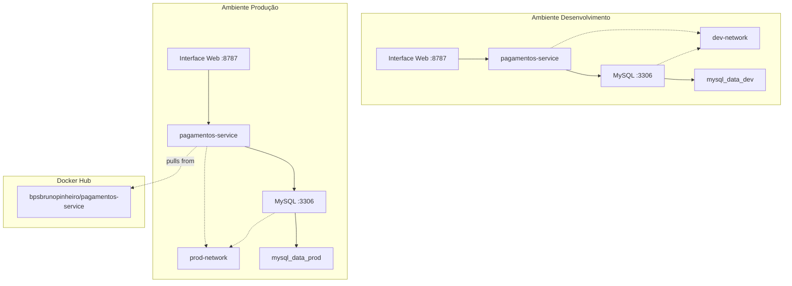

# 💳 E-commerce Microservice - Pagamentos Service

<div align="center">


[](https://hub.docker.com/r/bpsbrunopinheiro/pagamentos-service)
[](#-segurança-e-vulnerabilidades)
[](#licença)

</div>

## 📋 Índice

- [Visão Geral](#-visão-geral)
- [Características](#-características)
- [Arquitetura](#-arquitetura)
- [Docker Hub - Imagens Oficiais](#-docker-hub---imagens-oficiais)
- [Pré-requisitos](#-pré-requisitos)
- [Instalação e Configuração](#-instalação-e-configuração)
- [Uso](#-uso)
- [API Reference](#-api-reference)
- [Segurança e Vulnerabilidades](#-segurança-e-vulnerabilidades)
- [Backup e Recuperação](#-backup-e-recuperação)
- [Monitoramento](#-monitoramento)
- [Troubleshooting](#-troubleshooting)
- [Contribuição](#-contribuição)

## 🎯 Visão Geral

Este projeto implementa um **microserviço containerizado** para gerenciamento de pagamentos de e-commerce, desenvolvido com **Python/Flask** e **MySQL**, seguindo as melhores práticas de DevOps e arquitetura de containers.

### 🚨 Alerta de Segurança

> ⚠️ **Versão Recomendada**: `bpsbrunopinheiro/pagamentos-service:v1.0.1`  
> ✅ **Status**: Vulnerabilidades críticas corrigidas  
> 🔒 **Produção**: Aprovado para uso em produção

## ✨ Características

### 🏗️ Arquitetura e Infraestrutura

- ✅ **Containerização completa** com Docker e Docker Compose
- ✅ **Ambientes isolados** (desenvolvimento/produção)
- ✅ **Multi-stage builds** para otimização de imagens
- ✅ **Redes Docker isoladas** para cada ambiente
- ✅ **Volumes persistentes** com nomenclatura diferenciada

### 🛡️ Segurança

- ✅ **Usuário não-root** nos containers
- ✅ **Imagens Alpine Linux** minimalistas
- ✅ **Análise de vulnerabilidades** com Docker Scout
- ✅ **Variáveis de ambiente** seguras
- ✅ **Health checks** implementados

### 🔧 Funcionalidades

- ✅ **Processamento de pagamentos** (Cartão, PIX, Boleto)
- ✅ **Gestão de formas de pagamento**
- ✅ **Histórico de transações**
- ✅ **Interface web** intuitiva
- ✅ **API RESTful** completa

## 🏗️ Arquitetura



### 📁 Estrutura do Projeto

```
feature-pagamentos/
├── 📄 README.md                    # Documentação principal
├── 🔧 docker-compose.yml           # Configuração base
├── 🔧 docker-compose.dev.yml       # Override desenvolvimento
├── 🔧 docker-compose.prod.yml      # Override produção
├── 🔐 .env.dev                     # Variáveis desenvolvimento
├── 🔐 .env.prod                    # Variáveis produção
├── 🗄️ init.sql                     # Inicialização banco
└── 📁 pagamentos-service/
    ├── 🐍 app.py                   # Aplicação Flask
    ├── 🐳 dockerfile               # Produção (multistage)
    ├── 🐳 dockerfile.dev           # Desenvolvimento
    ├── 📦 requirements.txt         # Dependências Python
    └── 📁 templates/
        └── 🌐 index.html           # Interface web
```

## 🐳 Docker Hub - Imagens Oficiais

<div align="center">

[](https://hub.docker.com/repository/docker/bpsbrunopinheiro/pagamentos-service/tags)

📦 **Repositório Oficial**: `bpsbrunopinheiro/pagamentos-service`  
🔗 **Link**: https://hub.docker.com/repository/docker/bpsbrunopinheiro/pagamentos-service/tags

</div>

### 🏷️ Versões Disponíveis

| Tag      | Versão       | Status        | Tamanho | Segurança     | Recomendação    |
| -------- | ------------ | ------------- | ------- | ------------- | --------------- |
| `latest` | Mais recente | ✅ Ativa      | ~85MB   | 🛡️ Segura     | Desenvolvimento |
| `v1.0.1` | Estável      | ✅ LTS        | ~85MB   | 🛡️ Verificada | **Produção**    |
| `v1.0.0` | Inicial      | ⚠️ Deprecated | ~120MB  | ❌ Vulnerável | Não usar        |

### 🚀 Deploy com Docker Hub

#### 🔧 1. Deploy Rápido - Versão Latest

```bash
# 1. Fazer pull da imagem latest
docker pull bpsbrunopinheiro/pagamentos-service:latest

# 2. Executar container standalone
docker run -d \
  --name pagamentos-service \
  -p 8787:5000 \
  -e DB_HOST=seu-mysql-host \
  -e DB_USER=seu-usuario \
  -e DB_PASSWORD=sua-senha \
  -e DB_NAME=ecommerce_db \
  bpsbrunopinheiro/pagamentos-service:latest

# 3. Verificar status
docker ps --filter "name=pagamentos-service"

# 4. Testar aplicação
curl http://localhost:8787/status
```

#### 🏭 2. Deploy Produção - Versão v1.0.1 (Recomendada)

```bash
# 1. Fazer pull da versão específica
docker pull bpsbrunopinheiro/pagamentos-service:v1.0.1

# 2. Verificar integridade da imagem
docker inspect bpsbrunopinheiro/pagamentos-service:v1.0.1

# 3. Executar em modo produção
docker run -d \
  --name pagamentos-prod \
  --restart unless-stopped \
  --memory="512m" \
  --cpus="0.5" \
  -p 8787:5000 \
  -e FLASK_ENV=production \
  -e DB_HOST=mysql-prod.exemplo.com \
  -e DB_USER=app_user \
  -e DB_PASSWORD=senha_segura \
  -e DB_NAME=ecommerce_db \
  --health-cmd="curl -f http://localhost:5000/status || exit 1" \
  --health-interval=30s \
  --health-retries=3 \
  --health-start-period=40s \
  --health-timeout=10s \
  bpsbrunopinheiro/pagamentos-service:v1.0.1

# 4. Monitorar logs
docker logs -f pagamentos-prod
```

### 🔄 Deploy com Docker Compose

#### 📋 Configuração docker-compose.yml

```yaml
# docker-compose.hub.yml
version: '3.8'

services:
  pagamentos-service:
    image: bpsbrunopinheiro/pagamentos-service:v1.0.1
    container_name: pagamentos-hub
    restart: unless-stopped
    ports:
      - '8787:5000'
    environment:
      - FLASK_ENV=production
      - DB_HOST=mysql-db
      - DB_USER=${DB_USER:-admin}
      - DB_PASSWORD=${DB_PASSWORD:-admin123}
      - DB_NAME=${DB_NAME:-ecommerce_db}
    depends_on:
      mysql-db:
        condition: service_healthy
    networks:
      - pagamentos-net
    healthcheck:
      test: ['CMD', 'curl', '-f', 'http://localhost:5000/status']
      interval: 30s
      timeout: 10s
      retries: 3
      start_period: 40s

  mysql-db:
    image: mysql:8.0-debian
    container_name: mysql-hub
    restart: unless-stopped
    environment:
      MYSQL_ROOT_PASSWORD: ${DB_ROOT_PASSWORD:-root123}
      MYSQL_DATABASE: ${DB_NAME:-ecommerce_db}
      MYSQL_USER: ${DB_USER:-admin}
      MYSQL_PASSWORD: ${DB_PASSWORD:-admin123}
    volumes:
      - mysql_data_hub:/var/lib/mysql
      - ./init.sql:/docker-entrypoint-initdb.d/init.sql:ro
    networks:
      - pagamentos-net
    healthcheck:
      test:
        [
          'CMD',
          'mysqladmin',
          'ping',
          '-h',
          'localhost',
          '-u',
          'root',
          '-p${DB_ROOT_PASSWORD:-root123}',
        ]
      interval: 10s
      timeout: 5s
      retries: 5

volumes:
  mysql_data_hub:
    driver: local

networks:
  pagamentos-net:
    driver: bridge
```

#### 🚀 Executar com Docker Compose

```bash
# 1. Criar arquivo de configuração
cat > docker-compose.hub.yml << 'EOF'
# Cole o conteúdo do docker-compose.yml acima
EOF

# 2. Criar arquivo .env
cat > .env.hub << 'EOF'
DB_NAME=ecommerce_db
DB_USER=admin
DB_PASSWORD=admin123
DB_ROOT_PASSWORD=root123
EOF

# 3. Executar o stack
docker-compose -f docker-compose.hub.yml --env-file .env.hub up -d

# 4. Verificar status
docker-compose -f docker-compose.hub.yml ps

# 5. Acompanhar logs
docker-compose -f docker-compose.hub.yml logs -f
```

### 🔍 Verificação de Deploy

#### ✅ Health Checks Automáticos

```bash
# Verificar saúde do container
docker inspect pagamentos-prod --format='{{.State.Health.Status}}'

# Logs de health check
docker inspect pagamentos-prod --format='{{range .State.Health.Log}}{{.Output}}{{end}}'

# Status detalhado
docker ps --filter "name=pagamentos" --format "table {{.Names}}\t{{.Status}}\t{{.Ports}}"
```

#### 🔧 Testes de Funcionalidade

```bash
# 1. Health Check da aplicação
curl -f http://localhost:8787/status && echo "✅ Aplicação OK" || echo "❌ Aplicação com problema"

# 2. Teste da interface web
curl -f http://localhost:8787/ | grep -q "Pagamentos" && echo "✅ Interface OK" || echo "❌ Interface com problema"

# 3. Teste da API
curl -f http://localhost:8787/formas_pagamento && echo "✅ API OK" || echo "❌ API com problema"

# 4. Teste completo de funcionalidade
./scripts/test-api.sh  # Se disponível
```

### 🔄 Upgrade de Versões

#### 📈 Atualizar de v1.0.0 para v1.0.1

```bash
# 1. Parar container atual
docker stop pagamentos-prod

# 2. Backup dos dados (se necessário)
docker run --rm \
  -v pagamentos_mysql_data:/data:ro \
  -v "$(pwd)/backup:/backup" \
  alpine tar czf "/backup/mysql-backup-$(date +%Y%m%d).tar.gz" -C /data .

# 3. Fazer pull da nova versão
docker pull bpsbrunopinheiro/pagamentos-service:v1.0.1

# 4. Remover container antigo
docker rm pagamentos-prod

# 5. Executar nova versão
docker run -d \
  --name pagamentos-prod \
  --restart unless-stopped \
  -p 8787:5000 \
  -v pagamentos_mysql_data:/data \
  bpsbrunopinheiro/pagamentos-service:v1.0.1

# 6. Verificar se a atualização foi bem-sucedida
docker logs pagamentos-prod
curl http://localhost:8787/status
```

#### 🔄 Rolling Update com Docker Compose

```bash
# 1. Atualizar docker-compose.yml com nova versão
sed -i 's/v1.0.0/v1.0.1/g' docker-compose.hub.yml

# 2. Fazer pull da nova imagem
docker-compose -f docker-compose.hub.yml pull

# 3. Realizar rolling update
docker-compose -f docker-compose.hub.yml up -d --no-deps pagamentos-service

# 4. Verificar se o update foi bem-sucedido
docker-compose -f docker-compose.hub.yml ps
```

### 🛡️ Segurança das Imagens

#### 🔍 Verificação de Vulnerabilidades

```bash
# 1. Scan completo com Docker Scout
docker scout cves bpsbrunopinheiro/pagamentos-service:v1.0.1

# 2. Verificação rápida
docker scout quickview bpsbrunopinheiro/pagamentos-service:v1.0.1

# 3. Comparar versões
docker scout compare bpsbrunopinheiro/pagamentos-service:v1.0.0 \
  --to bpsbrunopinheiro/pagamentos-service:v1.0.1

# 4. Análise alternativa com Trivy
trivy image bpsbrunopinheiro/pagamentos-service:v1.0.1
```

#### 📋 Relatório de Segurança v1.0.1

```bash
# Gerar relatório detalhado
docker scout cves bpsbrunopinheiro/pagamentos-service:v1.0.1 \
  --format json > security-report-v1.0.1.json

# Resumo executivo
docker scout quickview bpsbrunopinheiro/pagamentos-service:v1.0.1 \
  --format table
```

### 📊 Monitoramento e Métricas

#### 📈 Monitoramento de Performance

```bash
# 1. Estatísticas de uso
docker stats pagamentos-prod --format "table {{.Container}}\t{{.CPUPerc}}\t{{.MemUsage}}\t{{.NetIO}}"

# 2. Logs estruturados
docker logs pagamentos-prod --since="1h" --follow

# 3. Health check contínuo
watch -n 30 'curl -s http://localhost:8787/status | jq .'
```

#### 🔍 Debug e Troubleshooting

```bash
# 1. Acessar container em execução
docker exec -it pagamentos-prod /bin/sh

# 2. Verificar variáveis de ambiente
docker exec pagamentos-prod env | grep -E "DB_|FLASK_"

# 3. Verificar conectividade de rede
docker exec pagamentos-prod ping mysql-db

# 4. Verificar logs detalhados
docker logs pagamentos-prod --details --timestamps
```

### 🚀 Scripts de Automação

#### 📋 Script de Deploy Automatizado

```bash
#!/bin/bash
# deploy-hub.sh - Deploy automatizado do Docker Hub

VERSION=${1:-v1.0.1}
ENVIRONMENT=${2:-production}

echo "🚀 Iniciando deploy da versão $VERSION em ambiente $ENVIRONMENT"

# 1. Pull da imagem
echo "📦 Fazendo pull da imagem..."
docker pull bpsbrunopinheiro/pagamentos-service:$VERSION

# 2. Verificar se a imagem existe
if ! docker image inspect bpsbrunopinheiro/pagamentos-service:$VERSION >/dev/null 2>&1; then
    echo "❌ Erro: Imagem não encontrada"
    exit 1
fi

# 3. Parar container atual (se existir)
if docker ps -q --filter "name=pagamentos-$ENVIRONMENT" | grep -q .; then
    echo "⏹️ Parando container atual..."
    docker stop pagamentos-$ENVIRONMENT
    docker rm pagamentos-$ENVIRONMENT
fi

# 4. Executar novo container
echo "🔄 Iniciando novo container..."
docker run -d \
    --name pagamentos-$ENVIRONMENT \
    --restart unless-stopped \
    -p 8787:5000 \
    bpsbrunopinheiro/pagamentos-service:$VERSION

# 5. Aguardar inicialização
echo "⏳ Aguardando inicialização..."
sleep 30

# 6. Verificar saúde
if curl -f http://localhost:8787/status >/dev/null 2>&1; then
    echo "✅ Deploy concluído com sucesso!"
    docker ps --filter "name=pagamentos-$ENVIRONMENT"
else
    echo "❌ Deploy falhou - verificar logs"
    docker logs pagamentos-$ENVIRONMENT
    exit 1
fi
```

```bash
# Dar permissão de execução
chmod +x deploy-hub.sh

# Executar deploy
./deploy-hub.sh v1.0.1 production
```

## 🔧 Pré-requisitos

| Ferramenta         | Versão Mínima | Comando de Verificação     |
| ------------------ | ------------- | -------------------------- |
| **Docker Desktop** | 4.0+          | `docker --version`         |
| **Docker Compose** | 2.0+          | `docker-compose --version` |
| **Git**            | 2.0+          | `git --version`            |

### 📋 Verificação do Ambiente

```bash
# Verificar todas as dependências
echo "🔍 Verificando dependências..."
docker --version && echo "✅ Docker OK" || echo "❌ Docker não encontrado"
docker-compose --version && echo "✅ Docker Compose OK" || echo "❌ Docker Compose não encontrado"
git --version && echo "✅ Git OK" || echo "❌ Git não encontrado"
```

## 🚀 Instalação e Configuração

### 1️⃣ Clone do Repositório

```bash
git clone <repository-url>
cd feature-pagamentos
```

### 2️⃣ Configuração de Ambiente

```bash
# Criar pasta para backups
mkdir -p backups

# Verificar arquivos de configuração
ls -la .env.*
```

### 3️⃣ Build das Imagens

```bash
# Build para desenvolvimento
docker build -f pagamentos-service/dockerfile.dev -t pagamentos-service:dev ./pagamentos-service

# Build para produção
docker build -f pagamentos-service/dockerfile -t bpsbrunopinheiro/pagamentos-service:v1.0.1 ./pagamentos-service
```

## 🎮 Uso

### 🔧 Ambiente de Desenvolvimento

```bash
# 1. Iniciar ambiente
docker-compose --env-file .env.dev -f docker-compose.yml -f docker-compose.dev.yml up -d

# 2. Verificar status
docker-compose --env-file .env.dev -f docker-compose.yml -f docker-compose.dev.yml ps

# 3. Acompanhar logs
docker-compose --env-file .env.dev -f docker-compose.yml -f docker-compose.dev.yml logs -f

# 4. Parar ambiente
docker-compose --env-file .env.dev -f docker-compose.yml -f docker-compose.dev.yml down
```

### 🏭 Ambiente de Produção

```bash
# 1. Configurar Docker Hub user no .env.prod
# DOCKER_HUB_USER=seuusuario

# 2. Iniciar ambiente
docker-compose --env-file .env.prod -f docker-compose.yml -f docker-compose.prod.yml up -d

# 3. Verificar status
docker-compose --env-file .env.prod -f docker-compose.yml -f docker-compose.prod.yml ps

# 4. Verificar logs
docker-compose --env-file .env.prod -f docker-compose.yml -f docker-compose.prod.yml logs -f
```

### 🌐 Acesso à Aplicação

| Serviço              | URL                                    | Descrição              |
| -------------------- | -------------------------------------- | ---------------------- |
| **Interface Web**    | http://localhost:8787                  | Dashboard principal    |
| **Health Check**     | http://localhost:8787/status           | Status da aplicação    |
| **API Pagamentos**   | http://localhost:8787/                 | Endpoint principal     |
| **Formas Pagamento** | http://localhost:8787/formas_pagamento | Gestão de métodos      |
| **Histórico**        | http://localhost:8787/historico        | Transações realizadas  |
| **MySQL (dev)**      | localhost:3309                         | Acesso direto ao banco |

## 📚 API Reference

### 🔍 Endpoints Disponíveis

| Método   | Endpoint            | Descrição            | Exemplo                                                                                  |
| -------- | ------------------- | -------------------- | ---------------------------------------------------------------------------------------- |
| **GET**  | `/`                 | Interface web        | `curl http://localhost:8787/`                                                            |
| **GET**  | `/status`           | Health check         | `curl http://localhost:8787/status`                                                      |
| **GET**  | `/formas_pagamento` | Listar métodos       | `curl http://localhost:8787/formas_pagamento`                                            |
| **POST** | `/formas_pagamento` | Cadastrar método     | `curl -X POST -d "forma_pagamento=Cartão Débito" http://localhost:8787/formas_pagamento` |
| **POST** | `/`                 | Processar pagamento  | `curl -X POST -d "cartao=4111111111111111" http://localhost:8787/`                       |
| **GET**  | `/historico`        | Histórico transações | `curl http://localhost:8787/historico`                                                   |

### 💳 Tipos de Pagamento Suportados

#### Cartão de Crédito

```bash
curl -X POST http://localhost:8787/ \
  -d "cartao=4111111111111111"
```

#### PIX

```bash
curl -X POST http://localhost:8787/ \
  -d "pix=usuario@exemplo.com"
```

#### Boleto

```bash
curl -X POST http://localhost:8787/ \
  -d "boleto=123456789"
```

### 📊 Responses de Exemplo

```json
// GET /status
{
  "status": "healthy",
  "service": "pagamentos-service",
  "timestamp": "2025-05-31T10:30:00Z"
}

// GET /historico
[
  {
    "id": 1,
    "tipo": "cartao",
    "detalhes": "Pagamento processado via Stripe",
    "data_criacao": "2025-05-31 10:30:00"
  }
]
```

## 🛡️ Segurança e Vulnerabilidades

### 🔒 Status Atual de Segurança

> ✅ **Versão Segura**: `v1.0.1`  
> 🛡️ **Vulnerabilidades Críticas**: 0  
> 📊 **Última Verificação**: 31/05/2025

### 🔍 Verificação de Segurança

```bash
# Análise completa de segurança
docker scout cves bpsbrunopinheiro/pagamentos-service:v1.0.1

# Verificação rápida
docker scout quickview bpsbrunopinheiro/pagamentos-service:v1.0.1

# Análise com Trivy (alternativo)
trivy image bpsbrunopinheiro/pagamentos-service:v1.0.1
```

### 📋 Dependências Seguras (v1.0.1)

| Dependência | Versão | Status    |
| ----------- | ------ | --------- |
| Flask       | 3.1.0  | ✅ Segura |
| Werkzeug    | 3.1.3  | ✅ Segura |
| Jinja2      | 3.1.6  | ✅ Segura |
| click       | 8.1.8  | ✅ Segura |
| PyMySQL     | 1.1.1  | ✅ Segura |

### 🛡️ Medidas de Segurança Implementadas

- **🔐 Usuário não-root**: Containers executam como `appuser`
- **🌐 Redes isoladas**: Comunicação segura entre containers
- **📦 Imagens minimalistas**: Alpine Linux reduz superfície de ataque
- **🔒 Secrets**: Variáveis sensíveis em arquivos `.env`
- **🚨 Health checks**: Monitoramento contínuo da aplicação

## 💾 Backup e Recuperação

### 📋 Comandos de Backup Testados

#### 🔧 Backup de Desenvolvimento

```bash
# Backup completo do volume MySQL (desenvolvimento)
docker run --rm \
  -v ecommerce_dev_mysql_data:/data:ro \
  -v "$(pwd)/backups:/backup" \
  alpine tar czf "/backup/mysql-volume-dev-$(date +%Y%m%d-%H%M%S).tar.gz" -C /data .

echo "✅ Backup de desenvolvimento concluído!"
```

#### 🏭 Backup de Produção

```bash
# Backup completo do volume MySQL (produção)
docker run --rm \
  -v ecommerce_prod_mysql_data:/data:ro \
  -v "$(pwd)/backups:/backup" \
  alpine tar czf "/backup/mysql-volume-prod-$(date +%Y%m%d-%H%M%S).tar.gz" -C /data .

echo "✅ Backup de produção concluído!"
```

### 🔄 Recuperação de Backup

```bash
# ⚠️ ATENÇÃO: Processo destrutivo - remove dados atuais

# 1. Parar ambiente
docker-compose --env-file .env.dev -f docker-compose.yml -f docker-compose.dev.yml down

# 2. Remover volume existente
docker volume rm ecommerce_dev_mysql_data

# 3. Recriar volume
docker volume create ecommerce_dev_mysql_data

# 4. Restaurar backup (ajustar nome do arquivo)
BACKUP_FILE="mysql-volume-dev-20250531-103000.tar.gz"
docker run --rm \
  -v ecommerce_dev_mysql_data:/data \
  -v "$(pwd)/backups:/backup" \
  alpine tar xzf "/backup/$BACKUP_FILE" -C /data

# 5. Reiniciar ambiente
docker-compose --env-file .env.dev -f docker-compose.yml -f docker-compose.dev.yml up -d
```

### 📊 Verificação de Backups

```bash
# Listar backups disponíveis
ls -la ./backups/*.tar.gz

# Verificar tamanho dos backups
du -h ./backups/

# Verificar último backup criado
ls -t ./backups/*.tar.gz | head -1

# Testar integridade do backup
ULTIMO_BACKUP=$(ls -t ./backups/*.tar.gz | head -1)
docker run --rm -v "$(pwd)/backups:/backup" alpine \
  tar -tzf "/backup/$(basename $ULTIMO_BACKUP)" | head -10
```

## 📊 Monitoramento

### 🔍 Comandos de Monitoramento

```bash
# Status geral dos containers
docker ps --filter "name=ecommerce"

# Uso de recursos
docker stats

# Logs em tempo real
docker-compose --env-file .env.dev -f docker-compose.yml -f docker-compose.dev.yml logs -f

# Verificar redes criadas
docker network ls | grep ecommerce

# Verificar volumes
docker volume ls | grep ecommerce
```

### 🗄️ Acesso ao Banco de Dados

```bash
# Conexão direta ao MySQL (desenvolvimento)
docker-compose --env-file .env.dev -f docker-compose.yml -f docker-compose.dev.yml exec mysql-db \
  mysql -u root -proot ecommerce_db

# Verificação rápida de dados
docker-compose --env-file .env.dev -f docker-compose.yml -f docker-compose.dev.yml exec mysql-db \
  mysql -u root -proot ecommerce_db -e "
    SHOW TABLES;
    SELECT COUNT(*) as total_transacoes FROM transacoes;
    SELECT COUNT(*) as total_formas_pagamento FROM pagamentos;
  "
```

### 📈 Health Checks

```bash
# Status da aplicação
curl -f http://localhost:8787/status || echo "❌ Aplicação não está respondendo"

# Teste de conectividade com banco
docker-compose --env-file .env.dev -f docker-compose.yml -f docker-compose.dev.yml exec mysql-db \
  mysqladmin ping -u root -proot || echo "❌ MySQL não está respondendo"
```

## 🔧 Troubleshooting

### ❌ Problemas Comuns

#### Container não inicia

```bash
# Verificar logs detalhados
docker-compose --env-file .env.dev -f docker-compose.yml -f docker-compose.dev.yml logs pagamentos-service

# Verificar configuração
docker-compose --env-file .env.dev -f docker-compose.yml -f docker-compose.dev.yml config
```

#### Erro de conexão com banco

```bash
# Testar conectividade
docker-compose --env-file .env.dev -f docker-compose.yml -f docker-compose.dev.yml exec mysql-db \
  mysql -u root -proot -e "SELECT 1"

# Verificar variáveis de ambiente
docker-compose --env-file .env.dev -f docker-compose.yml -f docker-compose.dev.yml exec pagamentos-service \
  env | grep DB_
```

#### Problemas de permissão

```bash
# Recriar volumes com permissões corretas
docker-compose --env-file .env.dev -f docker-compose.yml -f docker-compose.dev.yml down -v
docker volume prune -f
docker-compose --env-file .env.dev -f docker-compose.yml -f docker-compose.dev.yml up -d
```

#### Porta já em uso

```bash
# Verificar processos usando a porta 8787
lsof -i :8787

# Parar containers conflitantes
docker stop $(docker ps -q --filter "publish=8787")
```

### 🧹 Limpeza Geral

```bash
# Parar todos os ambientes
docker-compose --env-file .env.dev -f docker-compose.yml -f docker-compose.dev.yml down
docker-compose --env-file .env.prod -f docker-compose.yml -f docker-compose.prod.yml down

# Limpeza completa do sistema
docker system prune -af
docker volume prune -f
```

## 🚀 Comandos Rápidos - Cheat Sheet

### 📋 Desenvolvimento

```bash
# Iniciar
docker-compose --env-file .env.dev -f docker-compose.yml -f docker-compose.dev.yml up -d

# Logs
docker-compose --env-file .env.dev -f docker-compose.yml -f docker-compose.dev.yml logs -f

# Parar
docker-compose --env-file .env.dev -f docker-compose.yml -f docker-compose.dev.yml down
```

### 📋 Produção

```bash
# Iniciar
docker-compose --env-file .env.prod -f docker-compose.yml -f docker-compose.prod.yml up -d

# Logs
docker-compose --env-file .env.prod -f docker-compose.yml -f docker-compose.prod.yml logs -f

# Parar
docker-compose --env-file .env.prod -f docker-compose.yml -f docker-compose.prod.yml down
```

### 📋 Build e Deploy

```bash
# Build produção
docker build -f pagamentos-service/dockerfile -t bpsbrunopinheiro/pagamentos-service:v1.0.1 ./pagamentos-service

# Tag latest
docker tag bpsbrunopinheiro/pagamentos-service:v1.0.1 bpsbrunopinheiro/pagamentos-service:latest

# Push
docker push bpsbrunopinheiro/pagamentos-service:v1.0.1
docker push bpsbrunopinheiro/pagamentos-service:latest
```

### 📋 Testes Rápidos

```bash
# Aplicação
curl http://localhost:8787/status

# API
curl http://localhost:8787/formas_pagamento

# Histórico
curl http://localhost:8787/historico
```

## 🤝 Contribuição

### 🔄 Fluxo de Desenvolvimento

1. **Fork** do repositório
2. **Clone** do fork: `git clone <fork-url>`
3. **Branch** para feature: `git checkout -b feature/nova-funcionalidade`
4. **Desenvolvimento** com testes
5. **Commit** com mensagens claras: `git commit -m "feat: adiciona nova funcionalidade"`
6. **Push** para o fork: `git push origin feature/nova-funcionalidade`
7. **Pull Request** com descrição detalhada

### 📝 Padrões de Commit

- `feat:` Nova funcionalidade
- `fix:` Correção de bug
- `docs:` Atualização de documentação
- `style:` Formatação de código
- `refactor:` Refatoração
- `test:` Adição de testes
- `chore:` Tarefas de manutenção

### 🧪 Testes

```bash
# Executar testes locais
docker-compose --env-file .env.dev -f docker-compose.yml -f docker-compose.dev.yml up -d
./run-tests.sh
```

## 📄 Licença

Este projeto está licenciado sob a **MIT License** - veja o arquivo [LICENSE](LICENSE) para detalhes.

## 📞 Suporte

- 📧 **Email**: [seu-email@exemplo.com]
- 🐛 **Issues**: [GitHub Issues](link-para-issues)
- 📖 **Documentação**: [Wiki do Projeto](link-para-wiki)
- 🐳 **Docker Hub**: [bpsbrunopinheiro/pagamentos-service](https://hub.docker.com/r/bpsbrunopinheiro/pagamentos-service)

---

<div align="center">

**Desenvolvido para o ecossistema de microserviços**


</div>
